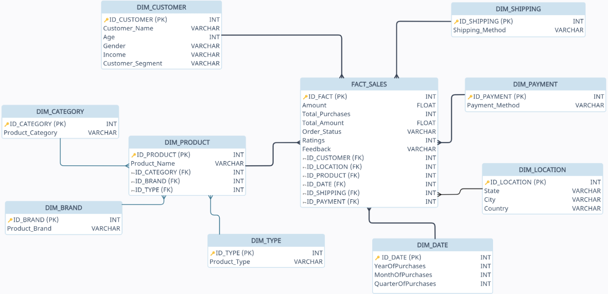
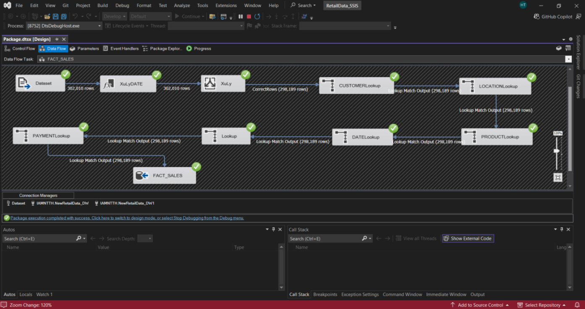
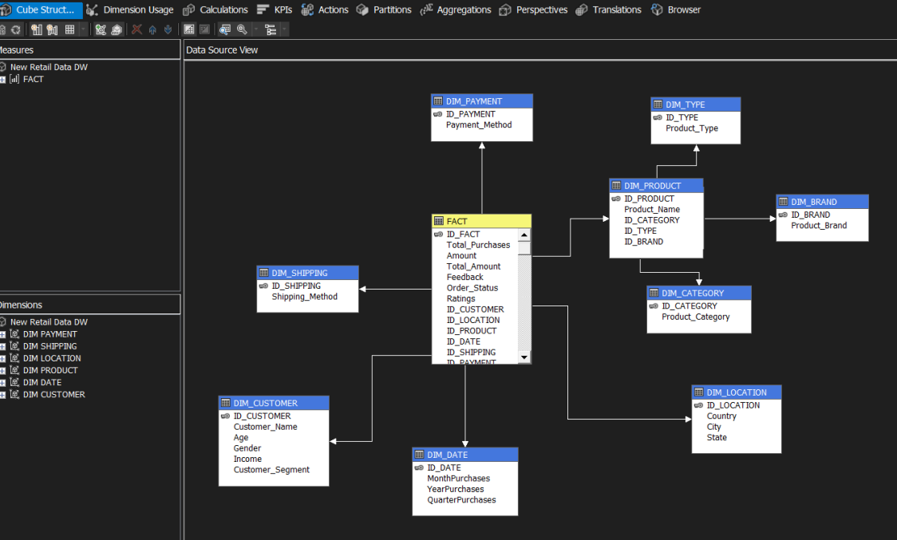
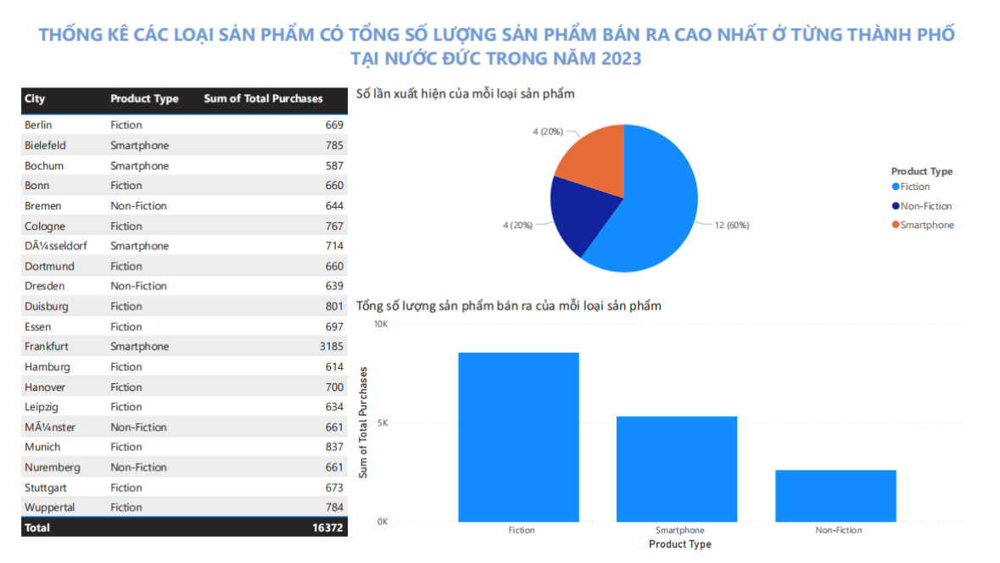
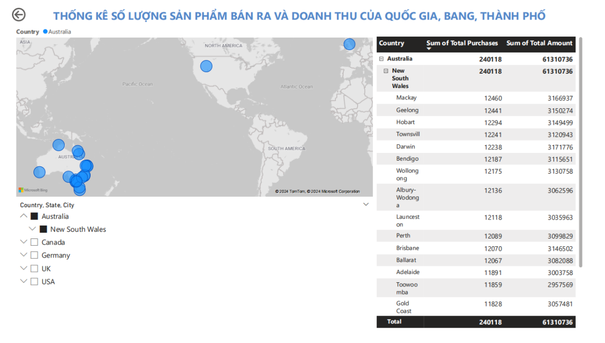
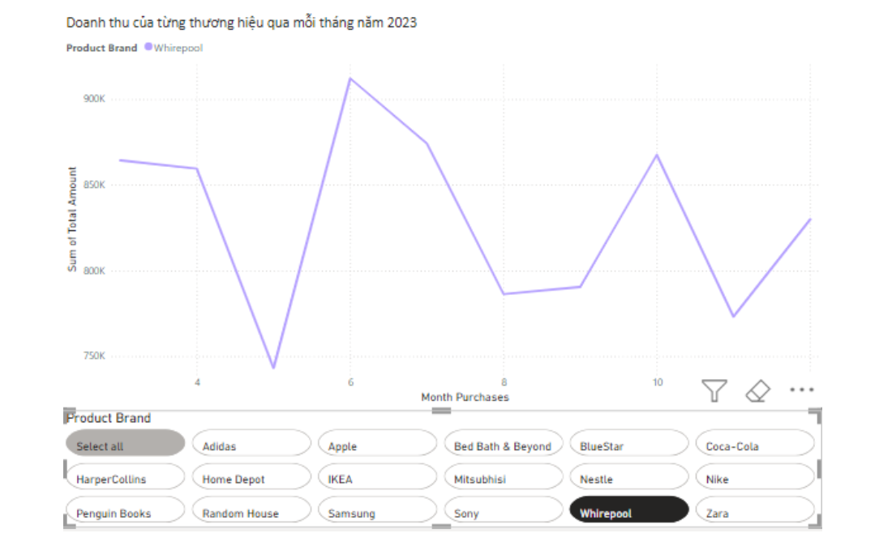

# Retail Transaction Data Warehouse & Analytics

An end-to-end **Data Warehouse and Business Intelligence project** for analyzing e-commerce retail transactions. The project covers the full analytical workflow, from raw data processing and ETL to multidimensional analysis and business reporting.

The solution uses **SSIS** to clean and integrate transaction data into **SQL Server**, models the warehouse using a **Snowflake Schema**, builds an **OLAP cube with SSAS**, performs multidimensional analysis using **MDX**, and creates interactive business reports in **Power BI**.

## Project Overview

The dataset contains retail transactions from **March 2023 to February 2024** across five countries:

* United States
* Germany
* Canada
* United Kingdom
* Australia

The raw dataset contains **302,010 transaction records and 30 attributes**, covering customer information, products, locations, transactions, shipping methods, payment methods, ratings, and order status.

After data cleaning and preprocessing, **298,189 records and 21 attributes** were retained for analytical processing.

**Dataset:** [Retail Analysis Large Dataset - Kaggle](https://www.kaggle.com/datasets/sahilprajapati143/retail-analysis-large-dataset/data)

---

## Tech Stack

| Category                | Technologies                                     |
| ----------------------- | ------------------------------------------------ |
| Database                | Microsoft SQL Server                             |
| ETL                     | SQL Server Integration Services (SSIS)           |
| Data Modeling           | Snowflake Schema                                 |
| OLAP                    | SQL Server Analysis Services (SSAS)              |
| Query Language          | SQL, MDX                                         |
| Visualization           | Power BI                                         |
| Additional Analysis     | Excel PivotTable, Looker Studio                  |
| Development Environment | Visual Studio 2022, SQL Server Management Studio |

---

## Data Pipeline

```text
Retail Transaction Dataset (CSV)
              │
              ▼
       Data Cleaning & ETL
              │
             SSIS
              │
              ▼
       SQL Server Data Warehouse
              │
              ▼
      Snowflake Data Model
              │
              ▼
          SSAS OLAP Cube
              │
       ┌──────┴──────┐
       ▼             ▼
      MDX         Power BI
   Analysis        Reports
```

The pipeline transforms raw transactional data into a structured analytical model that supports multidimensional querying and business reporting.

---

## Data Warehouse Design

A **Snowflake Schema** was designed around the central `FACT_SALES` table.


### Fact Table

**FACT_SALES**

Stores transaction-level facts, descriptive attributes, and foreign keys to analytical dimensions.

Main fields include:

- **Amount** — transaction amount
- **Total Amount** — total transaction value
- **Total Purchases** — quantity of products purchased
- **Ratings** — product rating
- **Feedback** — customer feedback
- **Order Status** — transaction order status

### Dimension Tables

The warehouse contains dimensions for:

* **Customer** — customer demographics and customer segment
* **Location** — country, state, and city
* **Date** — year, quarter, and month
* **Product** — product information
* **Brand** — product brand
* **Category** — product category
* **Type** — product type
* **Shipping** — shipping method
* **Payment** — payment method

Product information is further normalized into **Product, Brand, Category, and Type dimensions**, forming the snowflake structure.

---

## ETL Process with SSIS

SSIS pipelines were developed to transform the source CSV dataset and load data into SQL Server.

Major ETL operations included:

* Reading raw transaction data from CSV files.
* Converting and standardizing data types.
* Filtering invalid and blank records.
* Removing duplicate dimension records.
* Deriving **Year, Month, and Quarter** attributes from transaction dates.
* Loading dimension tables before the fact table.
* Performing lookup transformations to map dimension keys into `FACT_SALES`.
* Loading the final processed transaction data into the warehouse.
* Validating data loads through SSIS execution results and SQL Server queries, including row-count reconciliation between pipeline output and target tables.

### ETL Workflow


The `FACT_SALES` pipeline cleans and filters the source data, performs dimension lookups, and loads validated records into the fact table. From **302,010 source records**, **298,189 valid records** were retained for downstream analytical processing.

---

## OLAP Cube & Multidimensional Analysis

An **SSAS Multidimensional Cube** was built on top of the SQL Server Data Warehouse to support multidimensional analysis of retail transaction data.

The cube uses the `FACT_SALES` table as the central fact table and connects it with customer, product, location, time, shipping, and payment dimensions.



### Cube Structure

The SSAS cube consists of six main analytical dimensions:

- **DIM_CUSTOMER** — customer name, age, gender, income, and customer segment
- **DIM_LOCATION** — country, state, and city
- **DIM_DATE** — year, quarter, and month
- **DIM_PRODUCT** — product information, including category, brand, and product type attributes
- **DIM_SHIPPING** — shipping method
- **DIM_PAYMENT** — payment method

The `DIM_PRODUCT` dimension incorporates related product attributes from
`DIM_CATEGORY`, `DIM_BRAND`, and `DIM_TYPE`, reflecting the Snowflake Schema
of the underlying Data Warehouse.

### Fact Data Used for Analysis

The cube is built from `FACT_SALES`, which contains transactional values and foreign keys to analytical dimensions.

Main numerical fields used for analysis include:

* **Amount** — transaction amount
* **Total Amount** — total transaction value calculated as `Amount × Total Purchases`
* **Total Purchases** — quantity of products purchased
* **Ratings** — product rating value

The fact table also contains `Order_Status`, `Feedback`, and foreign keys linking each transaction to customer, location, product, date, shipping, and payment dimensions.

### Dimension Hierarchies

Hierarchies were created in SSAS to support drill-down and roll-up analysis at different levels of detail.

**Time hierarchy**

```text
Year
└── Quarter
    └── Month
```

This hierarchy supports analysis from yearly performance down to quarterly and monthly results.

**Location hierarchy**

```text
Country
└── State
    └── City
```

This hierarchy enables geographic analysis from country-level summaries to state and city details.

### Multidimensional Analysis with MDX

A set of **15 business analysis queries** was implemented using **MDX (Multidimensional Expressions)** against the SSAS cube. The analyses were grouped into several business perspectives, including sales and time, customer, product and brand, geography, and shipping.

#### Sales & Time Analysis

1. Calculate total sales in the **United States by quarter in 2023**.

2. Compare **number of orders, sales quantity, and revenue by country** across different time levels:

```text
Year → Quarter → Month
```

This analysis uses the time hierarchy to evaluate sales performance at different levels of granularity.

#### Customer Analysis

3. For each country, identify the **Top 10 products purchased by customers aged 18–25**, ranked by sales quantity.

4. Identify customers in **Florida** whose total purchased quantity exceeds 10 products.

5. Identify the customers with the **highest and lowest total purchase amounts**.

These queries combine customer attributes with sales and geographic dimensions to analyze customer purchasing behavior.

#### Product & Brand Analysis

6. Identify products whose total revenue falls between **2,000,000 and 3,000,000**.

7. For each product category, identify the **Top 3 brands by sales quantity in Q4 2023**.

8. For each product category, identify the **three months with the lowest sales quantity**.

9. Identify products with a **total sales quantity greater than 1,500 by country**, including product and category information.

10. Calculate **revenue and sales quantity by product type**.

11. Calculate the **average product rating by brand and product**.

These analyses evaluate product performance from multiple perspectives, including revenue, sales quantity, category, brand, time, and customer ratings.

#### Geographic Analysis

12. Analyze the **number of orders by state and year**, excluding New Mexico.

13. Analyze revenue using the geographic hierarchy with drill-down from:

```text
Country → State → City
```

14. Identify the **Top 3 cities with the highest revenue within each country**.

The geographic hierarchy supports both high-level country comparisons and detailed state- and city-level analysis.

#### Shipping Analysis

15. Calculate the number of transactions for each **shipping method** and its **percentage of total transactions**.

Together, these MDX queries demonstrate multidimensional analysis across **sales, time, customer, product, brand, geography, and shipping dimensions**, using filtering, ranking, aggregation, hierarchy navigation, and cross-dimensional analysis.


### Analysis Interfaces

The analytical requirements were explored through multiple interfaces:

- **SSAS Cube Browser** for interactive multidimensional exploration
- **Excel PivotTables** connected to the SSAS cube
- **MDX queries** for structured multidimensional analysis

This SSAS implementation covers the OLAP workflow from **Data Warehouse integration and cube modeling to hierarchy-based exploration and multidimensional querying**.

---

## Power BI Reporting

Power BI was connected to the **SSAS analytical model** to create business reports for sales and product performance analysis.

### 1. Product Sales by City

Analyzes the product types with the highest sales quantity across cities in Germany during 2023.



This report helps identify which product types perform strongly in different local markets.

---

### 2. Geographic Sales Performance

Analyzes:

* Sales quantity
* Revenue
* City-level performance
* State-level performance
* Country-level performance



The geographic hierarchy allows sales performance to be examined across different levels of location.

---

### 3. Monthly Brand Revenue

Analyzes monthly revenue trends for different product brands during 2023.



The report provides a time-based view of brand performance and makes it easier to compare monthly revenue patterns.

---

## Additional Reporting with Looker Studio

Additional reports were developed in Looker Studio using CSV data exported from the SSIS-processed dataset.

The reports analyzed:

- Monthly revenue by country
- Geographic revenue distribution by city and country
- Revenue, sales quantity, and order volume by product category and time period

---

## Key Project Outcomes

Through this project, an end-to-end analytical workflow was implemented covering:

**Data Integration**

Raw retail transaction data was cleaned, transformed, validated, and loaded into a structured SQL Server Data Warehouse using SSIS.

**Data Modeling**

A Snowflake Schema was designed to organize transactional data into reusable fact and dimension tables.

**Multidimensional Analytics**

An SSAS cube, dimension hierarchies, measures, and MDX queries were used to analyze sales across product, customer, geographic, and time dimensions.

**Business Intelligence**

Power BI reports were developed to support analysis of revenue, sales quantity, product performance, geographic performance, and monthly brand trends.

---

## Project Workflow

```text
Raw Retail Data
       │
       ▼
Data Cleaning & Transformation
       │
       ▼
SSIS ETL Pipelines
       │
       ├────────────► Processed CSV ────────► Looker Studio
       │
       ▼
SQL Server Data Warehouse
       │
       ▼
Snowflake Schema
       │
       ▼
SSAS Multidimensional Cube
       │
       ├────────────► SSAS Cube Browser
       ├────────────► MDX Analysis
       ├────────────► Excel Pivot Analysis
       └────────────► Power BI Reports
```

---

## Documentation

For detailed implementation steps, ETL transformations, OLAP configuration, MDX queries, and reporting processes, see the full project report:

[View Full Project Report](./Document/22520372_22520443_ProjectReport.pdf)

---

**Project period:** November 2024 – January 2025
